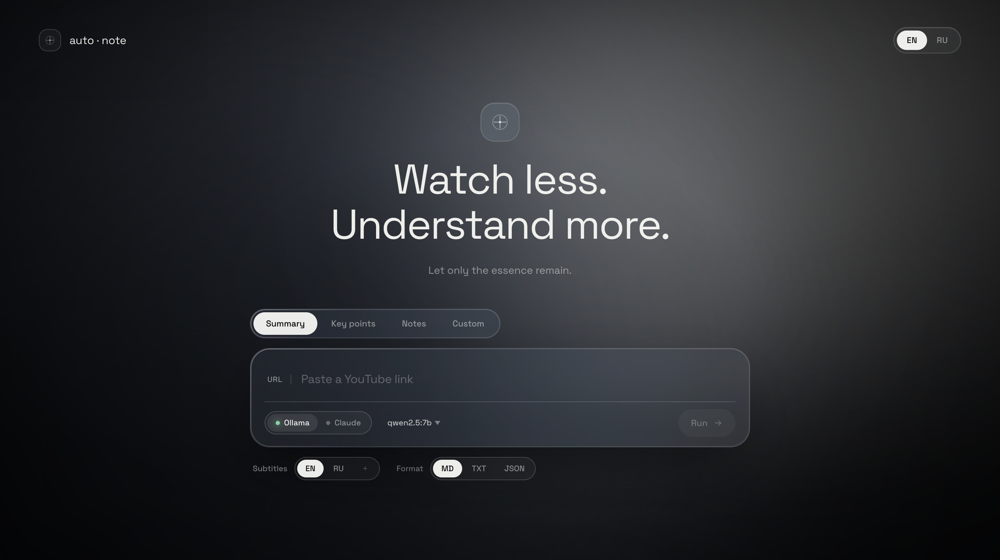

# auto·note

[Русский](README.ru.md)

> Paste a YouTube link. Get structured notes.

Pulls subtitles from any YouTube video and turns them into a summary, key points, or detailed notes using a local LLM or Claude. Streams output in real time. Supports Markdown, plain text, and JSON output.



---

## Quick start

```bash
git clone https://github.com/unrl888/auto-note && cd auto-note
echo "ANTHROPIC_API_KEY=sk-..." > .env  # optional, only for Claude
```

```bash
make up           # start — uses local Ollama if running, or Claude
make up-ollama    # start + launch ollama serve automatically
make down         # stop
```

Open **http://localhost:8000**

> Requires Docker. `ollama` optional — install from [ollama.com](https://ollama.com)

---

## Pull a model

```bash
make pull-model                           # qwen2.5:7b (default)
make pull-model OLLAMA_MODEL=llama3.2:3b
```

---

## Stack

- **Backend** — FastAPI + Python
- **LLM** — Ollama (local) · Claude API
- **Subtitles** — `youtube-transcript-api`
- **Frontend** — React 18 · glassmorphism UI

---

## Structure

```
app/
  api.py         — routes
  services.py    — subtitle fetch → prompt → LLM stream
  config.json    — prompts, providers, format hints
  web/           — React frontend (JSX + CSS-in-JS)

core/
  extractor/youtube.py     — subtitle extraction
  analyzer/llm/ollama.py   — Ollama client
  analyzer/llm/anthropic.py — Claude client
```
