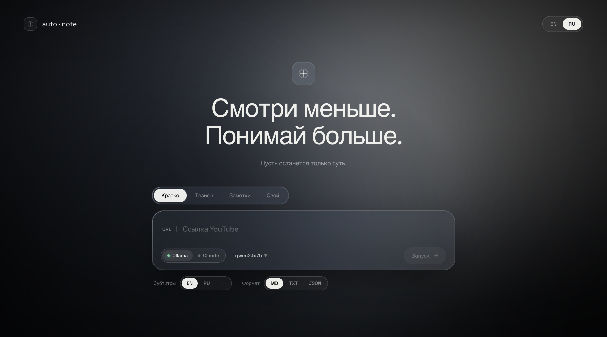

# auto·note

[English](README.md)

> Вставь ссылку на YouTube. Получи структурированные заметки.

Вытаскивает субтитры из любого YouTube-видео и превращает их в краткое резюме, тезисы или подробный конспект через локальный LLM или Claude. Стримит результат в реальном времени. Поддерживает Markdown, plain text и JSON.



---

## Быстрый старт

```bash
git clone https://github.com/unrl888/auto-note && cd auto-note
echo "ANTHROPIC_API_KEY=sk-..." > .env  # опционально, только для Claude
```

```bash
make up           # запуск — подключается к локальной Ollama или Claude
make up-ollama    # запуск + автоматически стартует ollama serve
make down         # остановить
```

Открыть **http://localhost:8000**

> Требуется Docker. `ollama` опционально — установить с [ollama.com](https://ollama.com)

---

## Скачать модель

```bash
make pull-model                           # qwen2.5:7b (по умолчанию)
make pull-model OLLAMA_MODEL=llama3.2:3b
```

---

## Стек

- **Бэкенд** — FastAPI + Python
- **LLM** — Ollama (локально) · Claude API
- **Субтитры** — `youtube-transcript-api`
- **Фронтенд** — React 18 · glassmorphism UI

---

## Структура

```
app/
  api.py         — роуты
  services.py    — субтитры → промпт → стрим LLM
  config.json    — промпты, провайдеры, подсказки форматов
  web/           — React фронтенд (JSX + CSS-in-JS)

core/
  extractor/youtube.py      — получение субтитров
  analyzer/llm/ollama.py    — клиент Ollama
  analyzer/llm/anthropic.py — клиент Claude
```
